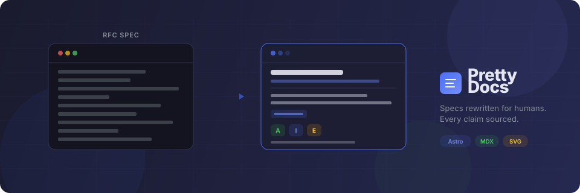

<p align="center">
  <a href="https://yarikleto.github.io/pretty-docs/">
    
  </a>
</p>

<p align="center">
  <strong>Old docs are ugly. These aren't.</strong>
</p>

Pretty Docs rewrites dense technical specifications — RFCs, man pages, standards — into clear, visual, well-sourced articles. Every claim cites the original spec. Every article is a companion to the original, not a replacement.

**[Browse articles](https://yarikleto.github.io/pretty-docs/)** | **[Contribute](https://yarikleto.github.io/pretty-docs/contributing/write-an-article/)**

---

### Before & After

<table>
<tr>
<th width="50%">Original RFC</th>
<th width="50%">Pretty Docs</th>
</tr>
<tr>
<td>

```
3.1.1.  DATA TYPES

   Data representations are handled in FTP
   by a user specifying a representation
   type.  This type may implicitly (as in
   ASCII or EBCDIC) or explicitly (as in
   Local byte) define a byte size for
   interpretation which is referred to as
   the "transfer byte size"...
```

</td>
<td>

FTP handles data in three independent dimensions: **type** controls interpretation (ASCII, Image, EBCDIC, Local), **structure** defines the layout (File, Record, Page), and **mode** determines how bytes travel over the wire (Stream, Block, Compressed).

*<sub>Source: RFC 959, Section 3.1</sub>*

</td>
</tr>
</table>

---

## Tech Stack

- [Astro](https://astro.build) + [Starlight](https://starlight.astro.build) static site
- MDX articles with custom citation components
- SVG diagrams with light/dark mode support
- [Pagefind](https://pagefind.app) for full-text search
- Zero backend, zero database

## Quick Start

```bash
git clone https://github.com/yarikleto/pretty-docs.git
cd pretty-docs
npm install
npm run build && npm run preview
```

Open [localhost:4321](http://localhost:4321) to view the site.

> `npm run dev` works for editing, but search requires a production build — use `build` + `preview` to test search.

## Project Structure

```
src/
  content/docs/            # Articles (MDX)
  components/
    article/               # SourceRef, RfcToggle, SourceCard, etc.
    diagrams/              # SVG diagram components
    landing/               # Landing page components
  styles/custom.css        # Starlight CSS overrides
astro.config.mjs           # Sidebar, navigation
```

## Contributing

We'd love more articles. The contribution guide covers everything:

**[How to write an article](https://yarikleto.github.io/pretty-docs/contributing/write-an-article/)**

The short version:

1. Pick a spec (RFC, man page, standard)
2. Create an MDX file — the file path mirrors the source URL
3. Write clear prose, cite every technical claim
4. Add diagrams where they help
5. Submit a PR

See the [style guide](https://yarikleto.github.io/pretty-docs/contributing/style-guide/) for tone, formatting, and component usage.

## License

Content is licensed under [CC BY-SA 4.0](https://creativecommons.org/licenses/by-sa/4.0/). Code is [MIT](https://opensource.org/licenses/MIT).
