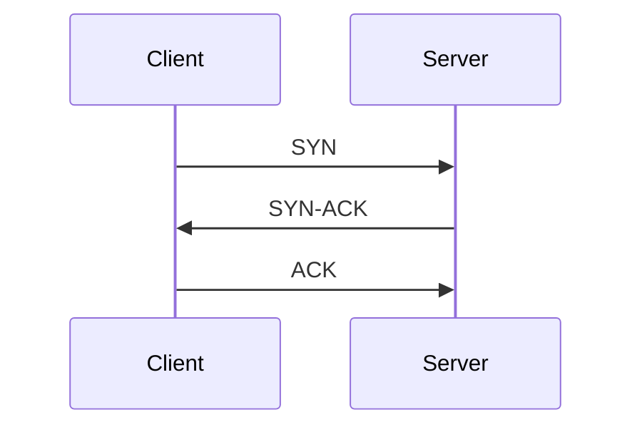

Pretty Docs turns unreadable technical specs into clear, visual, well-sourced articles. This guide walks you through writing and submitting a new one.

## Pick a topic

Pretty Docs covers foundational technical documentation that is hard to read in its original form: RFCs, man pages, POSIX standards, language specifications, file format specs.

Good candidates share these traits:

- **The original is hard to read.** Walls of plaintext, no diagrams, poor formatting. If a developer has to suffer through it, it belongs here.
- **The content is stable.** Specifications that change rarely are better than APIs that evolve every quarter.
- **Diagrams would help.** If the concept involves structure, flow, or relationships, a visual explanation adds real value over the original text.

Before you start writing, open a GitHub issue with your proposed topic. This avoids duplicate work and lets maintainers confirm the topic fits the project.

## Set up your environment

```bash
# Fork and clone the repository
git clone https://github.com/YOUR_USERNAME/pretty-docs.git
cd pretty-docs

# Install dependencies
npm install

# Start the dev server
npm run dev
```

The dev server runs at `http://localhost:4321` with hot reload. You can see your article update as you write.

## Create your article file

Articles live in `src/content/docs/` organized by category. Pick the category that fits your topic, or propose a new one in your GitHub issue.

```
src/content/docs/
  networking/          # Protocols: FTP, TCP, DNS, HTTP, etc.
  contributing/        # These pages (not for articles)
```

Create a new `.mdx` file in the appropriate directory:

```
src/content/docs/networking/tcp-congestion-control.mdx
```

Use kebab-case for the filename. The filename becomes the URL slug: `/networking/tcp-congestion-control/`.

## Write the frontmatter

Every article starts with YAML frontmatter. Starlight uses these fields to generate the page title, description, sidebar entry, and navigation.

```yaml
---
title: TCP Congestion Control
description: How TCP prevents network collapse — slow start, congestion avoidance, fast retransmit, and fast recovery explained with diagrams.
---
```

The `title` and `description` are required. Starlight supports additional optional fields:

```yaml
---
title: TCP Congestion Control
description: How TCP prevents network collapse — slow start, congestion avoidance, fast retransmit, and fast recovery explained with diagrams.
prev: false
next:
  label: "TCP Flow Control"
  link: "/networking/tcp-flow-control/"
sidebar:
  badge:
    text: New
    variant: tip
---
```

| Field | Required | Purpose |
|-------|----------|---------|
| `title` | Yes | Page heading and sidebar label |
| `description` | Yes | Shown below the title and used for SEO meta description |
| `prev` / `next` | No | Override auto-generated pagination links. Set to `false` to hide. |
| `sidebar.badge` | No | Small badge on the sidebar item (e.g., "New") |

## Structure your article

Follow this structure. Every Pretty Docs article uses the same pattern so readers always know what to expect.

### 1. Opening paragraph

A concise summary of what the article covers and why it matters. No more than 3-4 sentences. Write it for someone who found the page via search and needs to know if this is what they are looking for.

### 2. Overview section

Set up the mental model. If the topic has multiple dimensions or parts, introduce them here with a diagram. This is where readers build the map before diving into details.

### 3. Main sections

One section per major concept. Each section should:

- Start with the simplest explanation
- Add detail progressively
- Include a diagram or code example where it helps
- End with a `<SourceRef>` citation linking back to the original spec

### 4. Callouts

Use Starlight's built-in callout syntax for important notes and warnings:

```mdx
:::note
Most modern FTP clients default to **binary mode** to avoid accidental data corruption.
:::

:::caution
Compressed mode is largely obsolete. Use TLS-level compression instead.
:::
```

`:::note` renders as a blue info box. `:::caution` renders as an amber warning box.

### 5. Source & Further Reading

Every article ends with a `<SourceCard>` linking to the original specification and related resources.

## Use custom components

Pretty Docs provides several components you can import in your MDX files. Import them at the top of your file, after the frontmatter.

### ArticleMeta

Renders the source badge, "View original" link, and reading time below the article description.

```mdx
import ArticleMeta from '../../../components/article/ArticleMeta.astro';

<ArticleMeta
  source="RFC 959, Section 3"
  sourceUrl="https://www.w3.org/Protocols/rfc959/4_FileTransfer.html"
  readingTime="12 min"
/>
```

| Prop | Type | Description |
|------|------|-------------|
| `source` | `string` | Source label, e.g. `"RFC 959, Section 3"` |
| `sourceUrl` | `string` | URL to the original document |
| `readingTime` | `string` | Estimated reading time, e.g. `"12 min"` |

### SourceRef

Inline source citation with a left border. Place after diagrams, tables, or significant claims.

```mdx
import SourceRef from '../../../components/article/SourceRef.astro';

<SourceRef section="3.1.1" quote="Data types are defined by the TYPE command." />
```

| Prop | Type | Description |
|------|------|-------------|
| `section` | `string` | Section number, e.g. `"3.1.1"` |
| `quote` | `string?` | Optional quoted text from the source |

### SourceCard

End-of-article card linking to the original source and further reading.

```mdx
import SourceCard from '../../../components/article/SourceCard.astro';

<SourceCard
  title="RFC 793 &mdash; Transmission Control Protocol"
  description="J. Postel, September 1981. The specification this article is based on."
  links={[
    { label: "Read the full RFC", href: "https://www.rfc-editor.org/rfc/rfc793" },
    { label: "IETF Datatracker", href: "https://datatracker.ietf.org/doc/html/rfc793" }
  ]}
/>
```

| Prop | Type | Description |
|------|------|-------------|
| `title` | `string` | Source document title (supports HTML entities like `&mdash;`) |
| `description` | `string` | Brief description of the source and what it covers |
| `links` | `{ label: string; href: string }[]` | Array of external resource links |

### RfcToggle

Collapsible panel that shows the original RFC text alongside your explanation. Collapsed by default.

```mdx
import RfcToggle from '../../../components/article/RfcToggle.astro';

<RfcToggle section="3.1.1">
{`   3.1.1.  DATA TYPES

   Data representations are handled in FTP by a user
   specifying a representation type.`}
</RfcToggle>
```

| Prop | Type | Description |
|------|------|-------------|
| `section` | `string` | Section number shown in the panel header |
| `label` | `string?` | Button text when collapsed (default: `"See original RFC text"`) |

The component's default slot receives the original spec text. Use a template literal (`` {`...`} ``) to preserve whitespace and formatting.

### StructureCard

Card with a colored letter icon, title, and description. Use when listing structured options (like File/Record/Page structures).

```mdx
import StructureCard from '../../../components/article/StructureCard.astro';

<StructureCard
  letter="F"
  title="File Structure"
  description="The file is a continuous sequence of bytes with no internal structure."
/>
```

| Prop | Type | Description |
|------|------|-------------|
| `letter` | `string` | Single character for the icon (e.g. `"F"`) |
| `title` | `string` | Card heading |
| `description` | `string` | Body text |

### FtpSession

Custom code block for protocol session examples with manual syntax highlighting.

```mdx
import FtpSession from '../../../components/article/FtpSession.astro';

<FtpSession title="FTP Session" context="Control connection (port 21)">
<span class="syn-response">220 ftp.example.com ready</span>
<span class="syn-command">USER</span> <span class="syn-string">anonymous</span>
<span class="syn-response">331 Password required</span>
<span class="syn-command">PASS</span> <span class="syn-string">user@example.com</span>
<span class="syn-response">230 Login successful</span>
</FtpSession>
```

| Prop | Type | Description |
|------|------|-------------|
| `title` | `string?` | Header label on the left |
| `context` | `string?` | Label on the right side of the header |

Syntax classes for `<span>` elements in the slot:

| Class | Color | Use for |
|-------|-------|---------|
| `syn-keyword` | purple | Protocol keywords |
| `syn-string` | green | String values, paths |
| `syn-command` | amber | Protocol commands (USER, PASS, TYPE) |
| `syn-response` | blue | Server response lines |
| `syn-number` | orange | Numeric values |
| `syn-comment` | gray | Inline comments |

## Create diagrams

Diagrams are one of the key things that make Pretty Docs better than the original specs. There are two approaches:

### Astro SVG components (preferred for complex diagrams)

Create an Astro component in `src/components/diagrams/` that renders inline SVG. This gives you full control over dark mode, layout, and styling.

```
src/components/diagrams/YourDiagram.astro
```

Your SVG component should:

- Use CSS classes for colors, not inline `fill`/`stroke` attributes, so dark mode works
- Target `:root[data-theme='dark']` in a scoped `<style>` block for dark mode colors
- Use the `Inter` font family for text elements
- Wrap the SVG in a container `<div>` with appropriate background and padding
- Use the existing dark mode CSS classes from `custom.css` where possible: `.axis-card`, `.axis-card-text`, `.axis-card-sub`

Import your diagram in the article:

```mdx
import YourDiagram from '../../../components/diagrams/YourDiagram.astro';

<YourDiagram />
```

### Mermaid diagrams (good for simpler diagrams)

For flowcharts, sequence diagrams, and other standard diagram types, Mermaid is a lower-effort option. Write the diagram directly in your MDX using a fenced code block:

````mdx

````

Mermaid diagrams adapt to dark mode automatically.

### Static images

If your diagram is a one-off that does not need dark mode adaptation, you can use a static PNG or SVG file in `src/assets/`:

```mdx
import myDiagram from '../../../assets/my-diagram.png';


```

### Diagram guidelines

Regardless of approach:

- Every diagram needs a `<SourceRef>` citation immediately below it
- Labels should be short and clear
- Use the project's color palette (indigo/blue for primary, green for secondary, amber for tertiary)
- Test in both light and dark mode

## Add source citations

Source citations are non-negotiable. Every Pretty Docs article must link back to the original specification.

**Inline citations** go after diagrams, tables, or significant claims:

```mdx
<SourceRef section="3.1.1" quote="Data types are defined by the TYPE command." />
```

**End-of-article citation** goes in the final section:

```mdx
## Source & Further Reading

<SourceCard
  title="RFC 793 &mdash; Transmission Control Protocol"
  description="J. Postel, September 1981. The specification this article is based on."
  links={[
    { label: "Read the full RFC", href: "https://www.rfc-editor.org/rfc/rfc793" },
    { label: "IETF Datatracker", href: "https://datatracker.ietf.org/doc/html/rfc793" }
  ]}
/>
```

Rules:

- Every article must have at least one `<SourceCard>` at the end
- Every diagram must have a `<SourceRef>` immediately below it
- Claims about specific spec behavior should cite the relevant section
- Link to the canonical source (RFC Editor, W3C, ISO, etc.), not third-party summaries

## Preview and test

Before submitting, verify your article:

```bash
# Start the dev server and check your page
npm run dev

# Build the site to catch any errors
npm run build
```

Check these things:

- [ ] Article renders correctly at its URL
- [ ] All components display properly
- [ ] Diagrams look right in both light and dark mode
- [ ] Source citations link to the correct documents
- [ ] Callouts render with correct styling
- [ ] The article appears in the sidebar under the right category
- [ ] No build errors or warnings

## Submit a pull request

1. Create a branch: `git checkout -b article/your-topic-name`
2. Commit your changes with a descriptive message
3. Push to your fork and open a PR against `main`
4. In the PR description, include:
   - What spec/document your article covers
   - A link to the original source
   - Any decisions you made about what to include or omit

Maintainers will review for accuracy, clarity, and consistency with the style guide. Expect feedback — the goal is to make every article excellent.

## Using Claude to help write

Pretty Docs includes a `CLAUDE.md` file at the project root with an AI-readable style guide. If you use Claude (or another AI assistant), point it at `CLAUDE.md` and the style guide page for context on tone, structure, and component usage.

Claude is good at:

- Drafting article sections from spec text
- Generating component markup with correct props
- Restructuring dense spec language into clear explanations
- Suggesting where diagrams would help

You are still responsible for:

- **Technical accuracy** — verify every claim against the original spec
- **Source citations** — Claude may not generate these correctly
- **Diagrams** — AI-generated diagrams rarely match the project's visual style
- **Final review** — read the article as a human reader would
